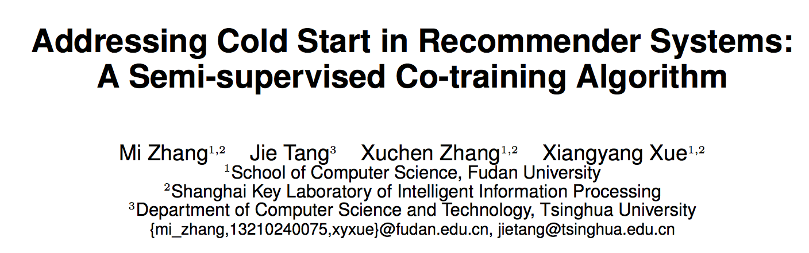

# WEBマーケティングの永遠の課題、Cold Start問題に挑んでみた！

## Cold Start問題とは？
　簡単に言えば、「新規ユーザー、新規商品」のレコメンドどうするの？

## なぜCold Start問題？

　Webビジネスの成功で非常に重要な、新規定着率に影響する。

　簡単に言えば、サイト全体のCVRを根本的に改善する。

　CVRの改善は、集客での許容CPCの上限値を改善する。（BigWord出稿が可能になり、広告費が指数関数的に増大する）

　許容CPC = 目標CPA * CVR

## なぜ、Cold Start問題の解決がCVRの根本的な解決になるのか？

　その根拠は以下のファクトによる。

 - 一般論として、既存ユーザーのCVR＞新規ユーザーのCVR が成り立つ。
 - また既存ユーザーは一定の確率で低減する。
 - 新規ユーザーは集客で獲得し、一定の割合で既存ユーザーに転向する。

　よって、Webサイト全体のCVRは下記で大まかに表現でき、既存ユーザーの増加が最も重要と言える。
　　全体CVR = 新規率 * 新規ユーザーの低いCVR + 既存率 * 既存ユーザーの高いCVR

　あたり前だが、既存ユーザーは「1)新規ユーザーにCVさせる。2)その人に再訪してもらう」ことで増加する。

　この（１）を改善する方法が、Cold-Start問題の解決になる。

## しかし、Cold Startは”問題”なのだ。

　それは、新規ユーザー（新規商品）には履歴データがない。

　　→　レコメンドできない。　→　新規ユーザーの離脱

　　　→　同じ（売れ筋）商品ばかりレコメンドされる。

　　　　→　CVRが高い既存ユーザーも飽きてくる

　　　　　　→　離脱する　（悪循環）

## 良い論文を見つけた！

半教師学習を使い「足りないデータは予測生成で補完」することでCold-Start問題を解決。

##
　
